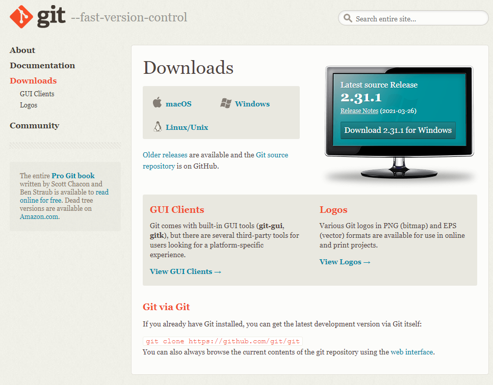
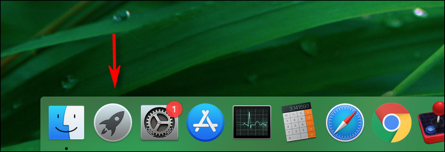
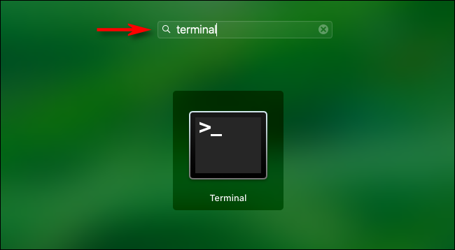

```{r setup, include=FALSE}
knitr::opts_chunk$set(echo = TRUE)
```

# Introduction
In previous years BIO8068 has been taught on-Campus, which meant that all students were using identical Campus Windows 10 PCs that had been configured by NUIT. As you will be working remotely this year, it is likely that you will have slightly different setups on your own PC, laptop, or MacBook, possibly with different versions of Windows or MacOS running on them. Some of you might decide to do the practicals using the University's Windows Virtual Desktop (WVD) system.

You will use a large number of R packages in this module, some of which you may not have encountered before. Some R packages will need to be 'compiled' from the original source code, which creates an extra difficulty. You will also regularly use some external programmes, that will need to be installed onto your computer, although you will actually operate them through R. This first workshop is therefore a technical one, to ensure that you all have access to a properly configured computer so that you can complete the rest of the module.

# 1. Compiling R packages
To compile an R package from its source code differs between Windows and MacBooks:

* MacBooks - everything should already be setup
* Windows - you will have to install an additional program called RTools40

## RTools40 (Windows)
You will need Administrator rights in order to install RTools; note that depending on your setup you may have to enter a different username or password, but on most Windows PCs the username for the main admin role is Administrator.  Go to:

<https://cran.r-project.org/bin/windows/Rtools/>

It is likely that nearly all of you will be using a 64-bit version of Windows, as only fairly old PCs are 32-bit. Download the file:

<https://cran.r-project.org/bin/windows/Rtools/rtools40-x86_64.exe>

The file `rtools40-x86_64`, the `.exe` might not be displayed, will probably be saved in your Downloads folder: double-click on it to begin the installation. At this point, you might be prompted to enter your Administrator password. Now start up RStudio, and in the RStudio Console enter the following command:

```{r, eval=FALSE}
writeLines('PATH="${RTOOLS40_HOME}\\usr\\bin;${PATH}"', con = "~/.Renviron")
```

This adds the folder that contains the RTools software to your R search "environment". Finally, you need to check that RStudio has detected everything correctly:

* Close RStudio down completely
* Restart RStudio again
* In the RStudio Console enter `Sys.which("make")`

If it is configured correctly, it might display:

`"C:\\rtools40\\usr\\bin\\make.exe"`

in response. However, don't panic if it displays `""` in response. The real test is whether it can install an R package from source. In the RStudio Console try entering:

```{r, eval=FALSE}
install.packages("jsonlite", type = "source")
```

You should see lots of information printed to screen as it installs the package. It takes a little longer than the default method of `type = "binary"` that you are used to using.

# 2. Reproducible research; version control with `git` and GitHub
You will be learning about the concepts of reproducible research in this module, which is of increasing importance in ecology, as scientists want to make both their data and analytical methods available for others to use. This involves two components:

* GitHub - This is a website <github.com> onto which you can register for free. It will allow you to store copies of your data and analyses, and share with other users and machines. We will spend time in a separate practical explaining how to register and use this website.
* `git` - this is the program that does the hard work of keeping track of different versions of code and data. It is installed on your local PC or MacBook.

If you find that you do not have `git` installed, you can access the main downloads page at <https://git-scm.com/downloads> which will display



## 2.1 `git` on MacOS
If you are using a MacBook, `git` should already be pre-installed. You can check by click on the Launchpad button and opening a terminal:



and then type Terminal:



The Terminal app should open in its own window. Type `which git` and hit the Enter key, and it should report something like `/usr/local/bin/git`. You can then check its version with `git --version`. In the unlikely event that it is not installed, you need the Xcode developer tools available via the main git downloads page (above) or from the Apple website <https://developer.apple.com/xcode/>. The actual download link is near the bottom of the webpage. After you have installed Xcode, open up your Terminal window and enter:

```{r, eval=FALSE}
git --version
git config
```

Accept the offer and click on "Install" and everything should get configured.

## 2.2 `git` on Windows
It is unlikely that you will already have `git` installed on Windows. If you want to check, start RStudio, then click on the "Terminal" tab, next to the RStudio Console tab at the bottom left. Try typing `git which` and hit the Enter key, followed by `git --version`; if you are lucky it will report that `git` is installed, and its version number. You are more likely to have to download and install the program. Go to the main git downloads page (above) and click the "Windows" option. The downloader should automatically detect which version of Windows you are using, and download the best version. It will probably again be saved into your Downloads folder. Double-click on it to install; again you will probably have to enter your Administrator password. Two key points for the installation process:

* When asked about “Adjusting your PATH environment”, make sure to select “Git from the command line and also from 3rd-party software”. Otherwise, accept the defaults.
* Note that RStudio for Windows prefers for Git to be installed below `C:/Program Files` and this appears to be the default. This implies, for example, that the Git executable on most Windows system is found at `C:/Program Files/Git/bin/git.exe`. My own laptop is managed by NUIT, so ironically, git is not in this location, but still works OK.

## 2.3 Configuring `git`
Before you can use `git` it needs to have a basic configuration, so it knows who you are. You can do this now, or during the relevant practical, where we cover this material again. In RStudio, start the RStudio Terminal window (**not** the RStudio Console) and type:

```{r, eval=FALSE}
git config --global user.name 'John Smith'
git config --global user.email 'j.smith123@newcastle.ac.uk'
git config --global --list
```

subsituting your real name (not your login number) and Newcastle University email address instead of `John Smith` and `j.smith123`.

# 3. Python, Keras and Tensorflow
You will use a couple of R packages that access external packages written in Python. This is a very similar language to R, and popular for data analytics, deep learning and artificial intelligence. You do not need to have an understanding of how Python works to use the relevant R packages, but you will need a working version of Python. We will use an R package called `keras` which calls external Python packages (Keras and Tensorflow). Therefore, we need to:

* 1. Check you have the correct version of Python installed
* 2. Install the R `keras` package
* 3. Check that R can connect via `keras` to Python

## 3.1 Install Python
### 3.1.1 MacOS
Python should be pre-installed on MacOS, but you will need to check that you have recent versions. Open up a MacOS Terminal window (see above) and enter `python --version` and `python3 --version`. It should confirm that you have both Python 2 and Python 3 available. In the unlikely event that it is missing, go to <https://www.python.org/downloads/release/python-392/> to download the most recent Python 3 version for MacOS.

### 3.1.2 Windows
Several 'flavours' of Python are available for Windows. You need to use the Anaconda distribution, which can be downloaded from <https://www.anaconda.com/products/individual>. The download link is near the bottom of the page. After you have downloaded the installation file, double-click on it to install; again you will probably need your Administrator password. **Warning** The Anaconda package is large at almost 500 Mb, so make sure you have a good internet connection before attempting to download.

## 3.2 Install the R `keras` package
This connects R to Python, and after installation automatically installs extra Python utilities. We will cover this in more detail at the relevant practical, but it will be useful to resolve any configuration problems as early as possible. If we are unable to resolve these problems, it is possible to use `keras` via the Windows Virtual Desktop service.

Start-up RStudio and in the command line type:

```{r, eval=FALSE}
install.packages("keras")
library(keras)
```

If this works OK, the next step is to install the connections to Python:

```{r, eval=FALSE}
install_keras()
```

The `install_keras()` function may take a while to run, as it installs additional Python and R packages. Finally, check that it can work, by seeing if it can load one of its built-in datasets; This is auto-downloaded from Google, and uncompressed via Tensorflow Python:

```{r, eval=FALSE}
mydata <- dataset_mnist()
summary(mydata)
```

```{r, echo=FALSE}
library(keras)
mydata <- dataset_mnist()
summary(mydata)
```

Ignore any warning messages about `h5py is running against HDF5 1.10.2 when built against 1.10.3` as these are just minor version differences. Before you continue, unload the `keras` package as it is quite a big one. Either untick the box against its name in the Packages tab (bottom right) of RStudio, or simply issue:

```{r}
detach("package:keras", unload = TRUE)
```

# 4. R packages for Citizen Science wildlife databases
You will make use of several Citizen Science databases, in particular the Global Biodiversity Information Facility (GBIF), iNaturalist and National Biodiversity Network Atlas sites. These have R packages to access them, but the latter is in development, and not available on CRAN in the usual manner. Check that they install successfully:

```{r, eval=FALSE}
# On CRAN, usually no problems
install.packages("rgbif")
install.packages("rinat") 
```

NBN4R can be trickier:

```{r, eval=FALSE}
install.packages("devtools")
library(devtools)
install_github("fozy81/NBN4R")
```

If you receive an error for an individual package, you may have to install it manually, e.g. if it gives errors for `stringr` and `sp` then try:

```{r, eval=FALSE}
install.packages(c("stringr","sp"))
install_github("fozy81/NBN4R")
```

# 5. R packages for wildlife acoustics
A large number of packages are available for acoustics data. In this module we will use the `behaviouR` package, which has the advantage of a good, online website book, and lots of useful functions that call the other packages, and make data-processing more accessible for ecologists. The main disadvantage is that it is not on CRAN, so might stumble. It also installs a lot of other packages in the background, any one of which may need checking:

```{r, eval=FALSE}
# Install 'behaviouR' package from Gitub
devtools::install_github("https://github.com/DenaJGibbon/behaviouR")
```

# 6. R packages for website development
You will develop an interactive "decision support system" for environmental management as part of this project, using an R package called `shiny` <https://shiny.rstudio.com/> which converts conventional R code into hyper-text markup language (HTML) so that you can create interactive web-pages. We need to check that you can install `shiny` and generate the default application:

```{r, eval=FALSE}
install.packages("shiny")
library(shiny)
```

Once you have installed it, in RStudio click on **File -> New File -> Shiny Web App...** Give the file whatever name you want. This will create a default application that should display a histogram of the frequency with which the "Old Faithful" hot water geyser in the USA sends a jet of water into the air, with sliders to change the appearance of the histogram. Check you can run the app, and that the histogram is displayed.

# 7. BIRDS Biodiversity Information Review & Decision Support
The BIRDS package helps assess changes in time and space with Citizen Science databases, and also evaluate its quality. You should be able to install it directly from CRAN, but it also uses quite a lot of packages in the background:

```{r, eval=FALSE}
install.packages("BIRDS")
```

# 8. Miscellaneous R packages
There are a lot of R packages used in this module, and I will admit that I am not 100% sure which ones are automatically installed, which you have already installed in previous modules such as BIO8069 or NES8010, and which are optional. Extra packages to consider include (I may have forgotten some!):

```{r, eval=FALSE}
library(ggplot2)
library(dplyr)
library(lubridate)
library(sp)
library(sf)
library(raster)
library(mapview)
library(leaflet)
library(leafem)
library(xts)
library(zoo)
library(shinipsum) # optional
library(camtrapR)  # optional
```

If you get messages saying that R cannot find the package then please install it - all of these packages are on CRAN so can be installed in the normal manner. If any of them fail to install then please consult myself or one of the PGR demonstrators.
